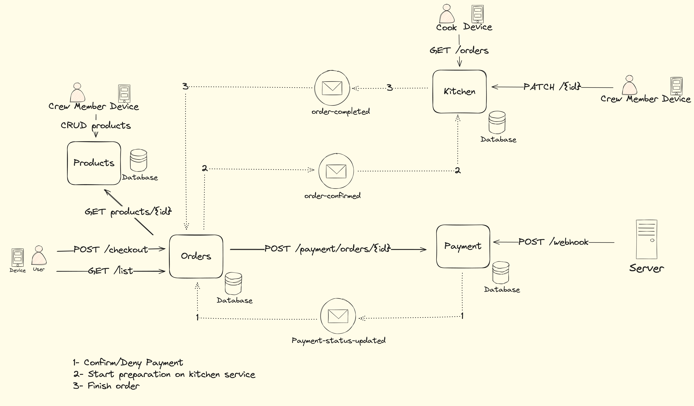

# Organização do Projeto de Sistema de Pagamento

Este repositório contém o código-fonte e a documentação do nosso sistema de pagamento. Abaixo, você encontrará as informações necessárias sobre a arquitetura do sistema, a justificativa para as escolhas de design, e os artefatos relacionados.

## Arquitetura do Sistema

O sistema de pagamento foi desenvolvido utilizando uma arquitetura baseada em microserviços, com cada serviço responsável por uma parte específica do fluxo de pagamento. A comunicação entre os serviços é feita de maneira assíncrona, utilizando eventos para garantir que cada serviço opere de forma independente e com baixo acoplamento.

## Justificativa do Padrão SAGA Coreografado Escolhido

Em um sistema de pagamento pequeno com um único fluxo compensatório, optar por uma saga coreografada em vez de uma orquestrada é mais vantajoso devido à simplicidade e à menor sobrecarga operacional. A coreografia permite que cada serviço conheça apenas seus próprios passos e eventos, resultando em uma implementação e manutenção mais simples. Além disso, os serviços são mais desacoplados, facilitando a escalabilidade e a modificação de componentes individuais sem impactar o sistema como um todo.

Por outro lado, a orquestração requer um orquestrador central para gerenciar o fluxo de trabalho, o que adiciona complexidade desnecessária em sistemas pequenos e aumenta o acoplamento entre os serviços. Portanto, a coreografia é a escolha mais adequada para manter a simplicidade, reduzir a sobrecarga e promover o desacoplamento em um sistema de pagamento de menor escala.

## Relatório RIPD

O relatório RIPD do sistema está disponível como um arquivo PDF na mesma pasta deste README.

[Baixar Relatório RIPD](../relatorio_ripd.pdf)

## Vídeo Explicativo

Para uma visão mais detalhada sobre a arquitetura e o funcionamento do sistema, assista ao vídeo no YouTube, onde explicamos o projeto e demonstramos o sistema em execução.

[Assista ao Vídeo no YouTube](https://youtu.be/1NHPQKzs6dc)

## Como Executar o Projeto

Instruções para configurar e executar o sistema estão detalhadas no README de cada repositório. Abaixo estão os links para os repositórios individuais:

- [Order Service](https://github.com/postech-food-challenge/order-service)
- [Payment Service](https://github.com/postech-food-challenge/payment-service)
- [Product Service](https://github.com/postech-food-challenge/product-service)
- [Kitchen Service](https://github.com/postech-food-challenge/kitchen-service)
- [Customer Service](https://github.com/postech-food-challenge/customer-service)

---

**Nota:** Este projeto foi desenvolvido como parte de uma avaliação técnica e não deve ser utilizado em ambientes de produção sem a devida revisão e adequação às necessidades específicas do caso de uso.